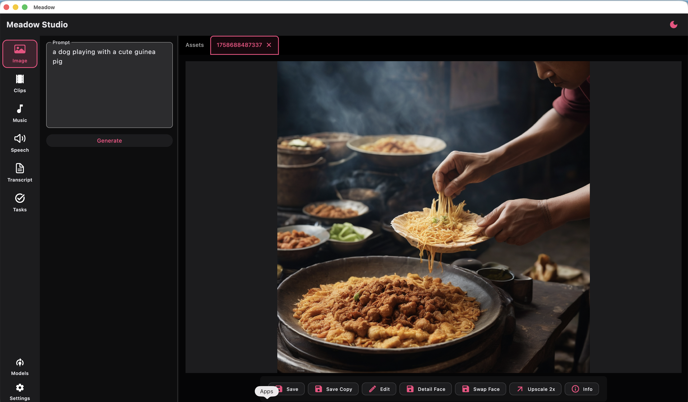
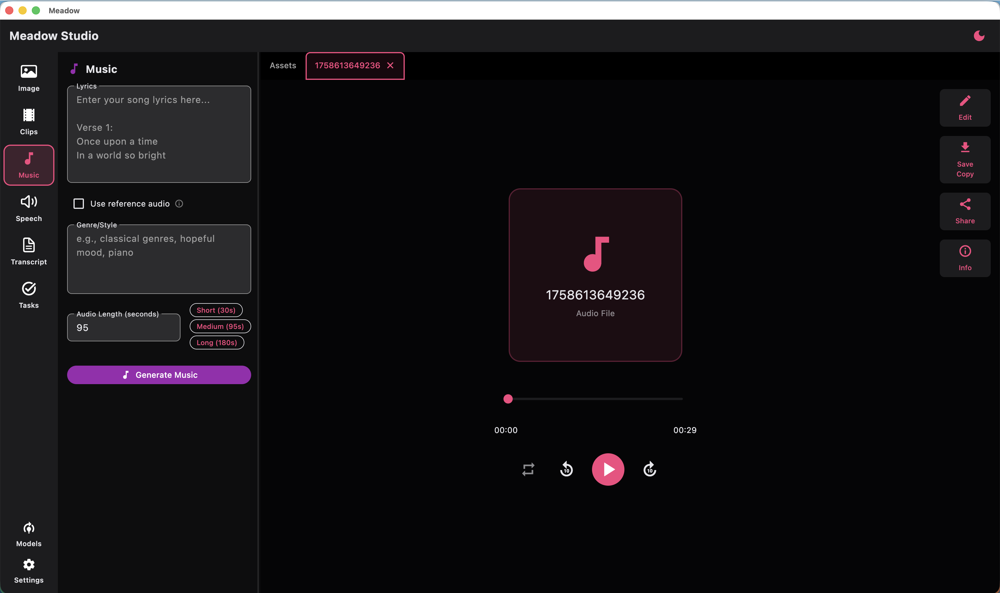

# 🌱 Meadow Studio

Meadow Studio, a local workspace for AI artists
Start your ComfyUI and get that GPU to work~

## ✨ Why use this

 - Generate image, video, music, speech, using your local ComfyUI
 - Manage your AI assets like a boss
 - Built in image and video editor WhatsApp-style, prolly won't need it but it's there
 - Make and combine AI videos
 - Local and privacy-focused, no data collection

## 💌 Feedback

- Use it, break it, tell me what went boom 💥 so I can fix it (and probably create a new bug or two)
- Join the Discord: [Blossom’s Nest](https://discord.gg/sSfFBXzk5W)
- Star the repo ⭐

## 🛠 Download

✅ Windows
[Portable ZIP](https://github.com/frozenblossom/meadow/releases/download/0.1.0/meadow_windows_x64.zip)

✅ MacOS
[MacOS DMG](https://github.com/frozenblossom/meadow/releases/download/0.1.0/meadow_mac.dmg)

✅ Linux
Coming soon, turns out some of the components don't support Linux, see what I can do

## Screenshots

Here's some screenshots

## License

AGPL-3

