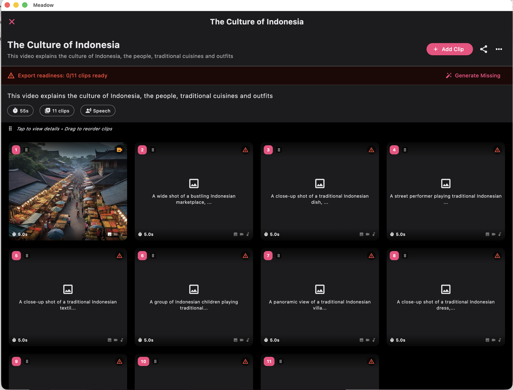

# 🌱 Meadow Studio

Meadow Studio, a local workspace for AI artists

Start your ComfyUI and get that GPU to work~

## ✨ Why use this

 - Generate image, video, music, speech, using your local ComfyUI
 - Manage your AI assets like a boss
 - Built in image and video editor WhatsApp-style, prolly won't need it but it's there
 - Make and combine AI videos
 - Local and privacy-focused, no data collection

## 💌 Feedback

- Use it, break it, tell me what went boom 💥 so I can fix it (and probably create a new bug or two)
- Join the Discord: [Blossom’s Nest](https://discord.gg/sSfFBXzk5W) - not much people here yet, probably only me
- Star the repo ⭐

## ComfyUI Custom Nodes

Install these from your ComfyUI manager

- **ComfyUI Impact Pack** - for face detailing
- **ComfyUI SubImpact Pack** - for face detailing
- **ReActor** - for face swapping
- **ACE Step** - for music generation
- **Ultimate SD Upscale** - yeah you know, for image upscaling

## Default models used

Use the model manager to download these, or download them manually

- **Dreamshaper XL Lightning** - for quickly generating images
- **WAN2.1** - for video generation
- **ACE-Step** - for music generation
- **F5-TTS** - for speech/narration generation

## 🛠 Download

The app is in early development, expect bugs and missing features. Currently have very frequent updates, check back for new versions like every week or twice a week

✅ Windows

[Portable ZIP](https://github.com/frozenblossom/meadow/releases/download/v0.2.0/meadow_winx64.zip)

Extract and run meadow.exe, if it's doesn't work install Visual C++ Redistributable, I have included that in the ZIP as well

✅ MacOS

[MacOS DMG](https://github.com/frozenblossom/meadow/releases/download/v0.2.0/Meadow.dmg)

✅ Linux

Coming soon, turns out some of the components don't support Linux, see what I can do

## Screenshots

Here's some screenshots

## License

AGPL-3

